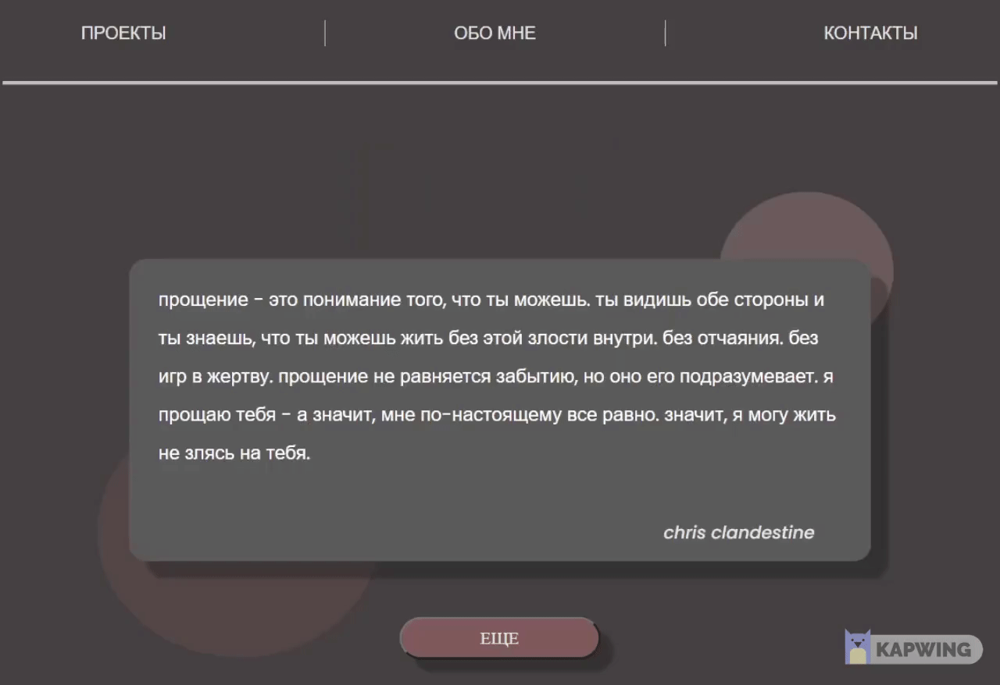

# Quote randomizer

https://quotes.irinamikheeva.ru/

#### My main goal was to learn how to operate with **fetch** and **promise** features, modern **ES6** syntax and **module structure**. 

##### This is my first project that I completed all by myself without helf of the tutorials, preseted designes or community. I wanted to build something just for myself that would have a personal value. I collected a lot of motivational and insiprational quotes, poetry and appealing music lines during the years - so I wanted to store them somewhere. I started building a simple database. Then I decided to put it in a simple project where I can try to create a fake API. 

##### This project is WIP. I'm planning to add a multilanguage feature. When the language is changed so is the database - a different one (With the chosen language) is going to be fetch from the server. 

### Technologies Used:
   
